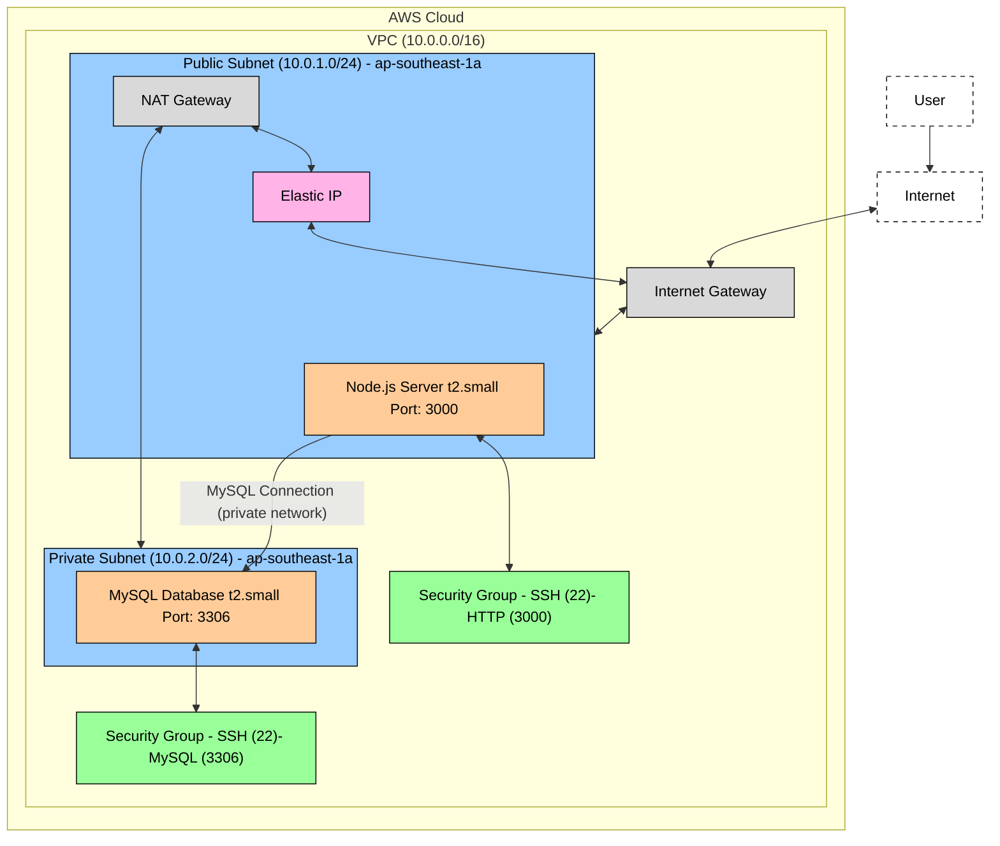

# Systemd Node.js with MySQL Infrastructure

This project deploys a two-tier application infrastructure on AWS using Pulumi:

- A Node.js application server in a public subnet
- A MySQL database server in a private subnet

## Prerequisites

- AWS account with appropriate permissions
- Python 3.6+ installed
- AWS CLI installed and configured

## Setup Instructions

### 1. Install Pulumi CLI

Choose the appropriate method for your operating system:

**macOS (with Homebrew):**

```bash
brew install pulumi
```

**Linux/macOS (without Homebrew):**

```bash
curl -fsSL https://get.pulumi.com | sh
```

**Windows (with PowerShell):**

```powershell
iwr -useb https://get.pulumi.com/install.ps1 | iex
```

Verify the installation:

```bash
pulumi version
```

### 2. Install AWS CLI

**macOS (with Homebrew):**

```bash
brew install awscli
```

**Linux/macOS (without Homebrew):**

```bash
curl "https://awscli.amazonaws.com/awscli-exe-linux-x86_64.zip" -o "awscliv2.zip"
unzip awscliv2.zip
sudo ./aws/install
```

**Windows:**
Download and run the AWS CLI MSI installer from the [AWS website](https://aws.amazon.com/cli/).

### 3. Configure AWS Credentials

Configure your AWS credentials:

```bash
aws configure
```

You'll need to enter:

- AWS Access Key ID
- AWS Secret Access Key
- Default region (e.g., ap-southeast-1)
- Default output format (json)

### 4. Clone the Repository

```bash
git clone <repository-url>
cd "Poridi Lab/systemd"
```

### 5. Install Python Dependencies

```bash
# Create and activate a virtual environment (optional but recommended)
python -m venv venv
source venv/bin/activate  # On Windows: venv\Scripts\activate

# Install the required packages
pip install pulumi pulumi-aws
```

### 6. Create SSH Key Pair

Create an AWS key pair named "db-cluster" for authenticating to EC2 instances:

```bash
# Navigate to SSH directory
cd ~/.ssh/

# Create key pair using AWS CLI
aws ec2 create-key-pair --key-name db-cluster --output text --query 'KeyMaterial' > db-cluster.id_rsa

# Set proper permissions
chmod 400 db-cluster.id_rsa
```

Note: If you already have a key pair named "db-cluster", you'll need to delete it first or use a different name and update the code accordingly.

## Deploying the Infrastructure

### 1. Login to Pulumi

```bash
pulumi login
```

For first-time users, this will prompt you to create a Pulumi account or login to an existing one.

### 2. Create a New Stack

```bash
pulumi stack init dev
```

This creates a new stack named "dev" for your deployment.

### 3. Set AWS Region (if needed)

```bash
pulumi config set aws:region ap-southeast-1
```

Replace "ap-southeast-1" with your preferred AWS region.

### 4. Deploy the Infrastructure

```bash
pulumi up
```

The command will:

1. Show a preview of resources to be created
2. Ask for confirmation - type "yes" to proceed
3. Create all resources (this may take 5-10 minutes)

### 5. Get Deployment Information

After successful deployment, record the outputs:

- `nodejs_public_ip`: Public IP of your Node.js server
- `db_private_ip`: Private IP of your database server

## Accessing Your Deployed Services

After successful deployment, Pulumi creates an SSH config file at `~/.ssh/config` that simplifies connecting to your servers.

1. Verify the SSH config file was created:

   ```bash
   cat ~/.ssh/config
   ```

   You should see entries for both `nodejs-server` and `db-server` with their respective IP addresses.

2. Access the Node.js application in your browser:

   ```
   http://<nodejs_public_ip>:3000
   ```

3. SSH into the Node.js server:

   ```bash
   ssh nodejs-server
   ```

4. SSH into the MySQL database server:

   ```bash
   ssh db-server
   ```

   Note: The connection to the database server is routed through the Node.js server as a jump host, as the database is in a private subnet.

5. Verify the database connection on the Node.js server:

   ```bash
   # While connected to nodejs-server
   curl localhost:3000/users
   ```

   This should return the list of users from the MySQL database.

## Destroying the Infrastructure

When you're done with the infrastructure, destroy all resources to avoid incurring additional costs:

```bash
pulumi destroy
```

Review the resources to be destroyed and confirm with "yes".

## Troubleshooting

### SSH Connection Issues

If you're unable to connect to the servers:

1. Verify the key pair exists in AWS:

   ```bash
   aws ec2 describe-key-pairs --key-name db-cluster
   ```

2. Check if the SSH config file was created properly:

   ```bash
   cat ~/.ssh/config
   ```

3. Ensure proper permissions on your private key:

   ```bash
   chmod 400 ~/.ssh/db-cluster.id_rsa
   ```

4. Try connecting with verbose output to debug issues:
   ```bash
   ssh -v nodejs-server
   ```

### Application Issues

If the Node.js application isn't working correctly:

1. Check if you can connect to the server:

   ```bash
   ssh nodejs-server
   ```

2. Verify the service is running:

   ```bash
   sudo systemctl status node-app.service
   ```

3. Check application logs:

   ```bash
   sudo journalctl -u node-app.service
   ```

4. Verify database connectivity:
   ```bash
   mysql -h <db_private_ip> -u app_user -p app_db
   # When prompted for password, enter: app_user
   ```

## Architecture

The infrastructure consists of:

- VPC with public and private subnets
- NAT Gateway for private subnet internet access
- Internet Gateway for public subnet
- Security groups for both servers
- EC2 instances running Ubuntu with automated setup scripts
- Node.js application connected to MySQL database

The Node.js application automatically connects to the MySQL database using environment variables.


