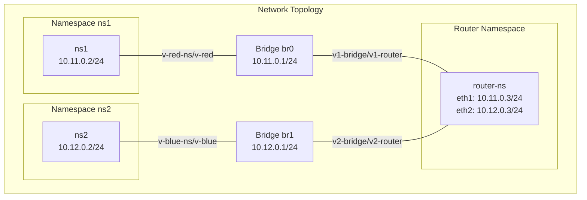

# Prerequisites

* Linux system with kernel version 5.x or later
* Root privileges
* Required packages:
    * iproute2
    * bridge-utils
    * iptables


# Installation

1. Clone the repository:

```
clone https://github.com/yourusername/network-namespace-script.git
cd network-namespace-script
```

2. Make the script executable:
```
chmod +x script.sh
```

# Usage
The script supports the following commands:

1. Setup the network:

```
sudo  ./script.sh setup
```

2. Test network connectivity:

```
sudo  ./script.sh ping
```

3. View current network status:

```
sudo  ./script.sh status
```

4. Clean up the network configuration:
```
sudo  ./script.sh cleanup
```

## Command Overview

| Command  | Description |
|----------|------------|
| `setup`  | Creates and configures network namespaces, bridges, and routing |
| `ping`   | Tests connectivity between namespaces |
| `status` | Shows current network configuration and routing tables |
| `cleanup` | Removes all created network configurations |

# Diagram


