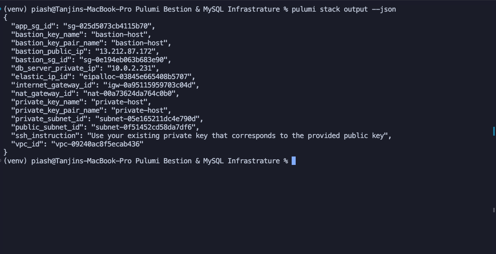
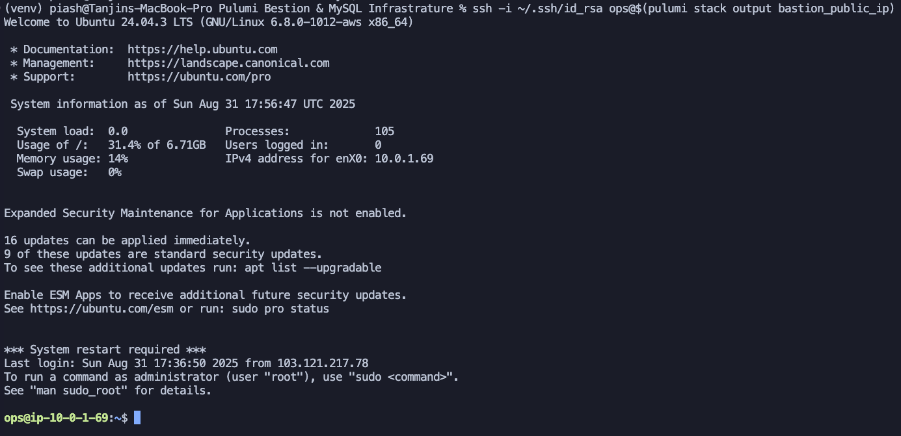
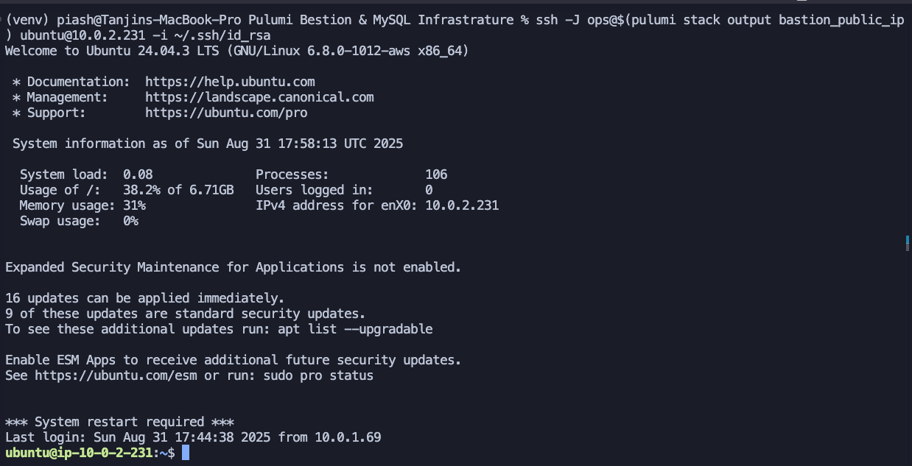
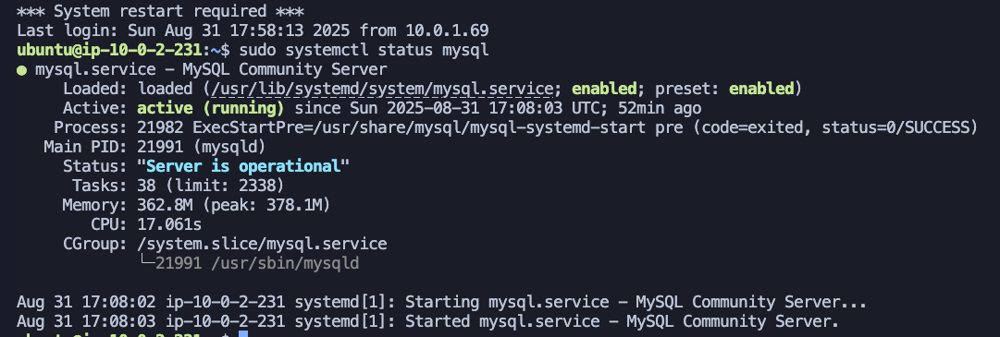
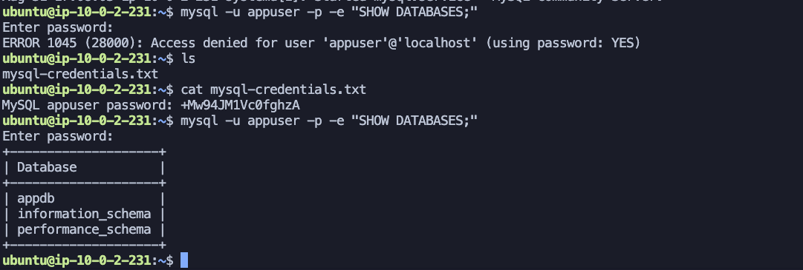
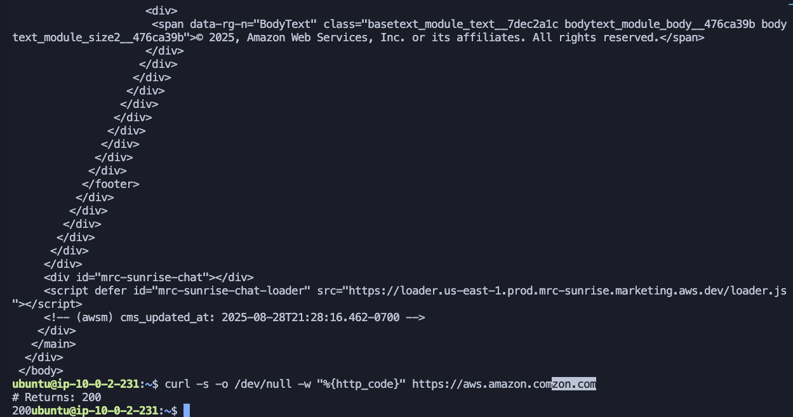
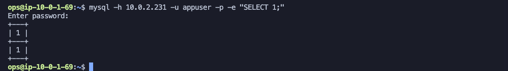

# AWS VPC with Bastion and Private Database Server

This project creates a secure AWS infrastructure using Pulumi with:

- VPC with public and private subnets
- Bastion host in public subnet
- MySQL database server in private subnet
- Proper security groups and routing

## Prerequisites

1. AWS CLI configured with appropriate credentials
2. Pulumi CLI installed
3. Python 3.7+ installed
4. Required SSH key pairs created in AWS EC2

## Setup

1. Clone this repository
2. Create your configuration file:
   ```bash
   cp Pulumi.dev.yaml.example Pulumi.dev.yaml
   ```

## Configuration

### Set Pulumi Configuration

```bash
# Set config (replace IP with yours)
pulumi config set allowedIp "YOUR_IP/32"
pulumi config set sshPublicKey "$(cat ~/.ssh/YOUR_KEY.pub)"

# Verify config
pulumi config
```

**Note**: Replace `YOUR_IP` with your actual public IP address (e.g., `203.0.113.1/32`) and `YOUR_KEY` with your SSH key filename (e.g., `id_rsa`).

## Deployment

### Install dependencies

```bash
pip install -r requirements.txt
```

### Follow Infraup.sh

```bash
./infraup.sh
```

## Task Evidence

### Task 1: Infrastructure Setup



### Task 2: Bastion Host Configuration



### Task 3: Database Server Setup



### Task 4: SSH Access Configuration




### Task 5: MySQL Database Verification




## Architecture

```
Internet
    |
    v
Internet Gateway
    |
    v
Public Subnet (10.0.1.0/24)
    |
    +-- Bastion Host (EC2)
    |   - Public IP
    |   - SSH access from allowed IPs
    |
    v
NAT Gateway
    |
    v
Private Subnet (10.0.2.0/24)
    |
    +-- Database Server (EC2)
        - Private IP only
        - MySQL server
        - SSH access via bastion
```

## Security Features

- **Bastion Host**: Secure entry point with restricted SSH access
- **Private Database**: Isolated in private subnet, no direct internet access
- **Security Groups**: Granular access control between resources
- **NAT Gateway**: Outbound internet access for private subnet updates
- **SSH Hardening**: Disabled root login and password authentication

## Usage

1. SSH to bastion: `ssh ops@<bastion-public-ip>`
2. From bastion, access database: `ssh ubuntu@<db-private-ip>`
3. Connect to MySQL: `mysql -h <db-private-ip> -u appuser -p`

## Cleanup

```bash
pulumi destroy
```
