# Microservices VXLAN Project

## Overview

The Microservices VXLAN Project demonstrates a scalable microservices architecture using VXLAN (Virtual Extensible LAN) for network virtualization. This project simulates a distributed system with multiple services communicating over a virtualized network infrastructure, using NGINX for service simulation and load balancing.

## Architecture

### Multi-Datacenter Design

- **DC1 (Primary)**: North America region - VXLAN ID 200 (10.1.0.0/16)
  - Primary services: Gateway, User, Order, Catalog, Analytics
- **DC2 (Secondary)**: Europe region - VXLAN ID 300 (10.2.0.0/16)
  - Backup gateway + Payment, Notification, Order replica
- **DC3 (Disaster Recovery)**: Asia-Pacific region - VXLAN ID 400 (10.3.0.0/16)
  - Full standby deployment + Primary Discovery service

### Services Distribution

#### DC1 (North America - Primary)

- **Gateway Service** (Port 80): Primary API Gateway and load balancer
- **User Service** (Port 8082): User management and authentication (Primary)
- **Order Service** (Port 8084): Order processing (Primary)
- **Catalog Service** (Port 8083): Product catalog management (Primary)
- **Analytics Service** (Port 8087): Analytics and reporting (Primary)

#### DC2 (Europe - Secondary)

- **Gateway Service** (Port 8080): Backup API Gateway
- **Payment Service** (Port 8085): Payment processing (Primary)
- **Notification Service** (Port 8086): Notification delivery (Primary)
- **Order Service** (Port 8088): Order processing (Replica)

#### DC3 (Asia-Pacific - Disaster Recovery)

- **Gateway Service** (Port 8081): Standby API Gateway
- **Discovery Service** (Port 8500): Service discovery and health monitoring (Primary)
- **User Service** (Port 8089): User management (Standby)
- **Order Service** (Port 8090): Order processing (Standby)
- **Catalog Service** (Port 8091): Product catalog (Standby)
- **Payment Service** (Port 8092): Payment processing (Standby)
- **Notification Service** (Port 8093): Notification delivery (Standby)
- **Analytics Service** (Port 8094): Analytics and reporting (Standby)

### Network Topology

The project implements VXLAN overlay networks to create isolated network segments for different service tiers, enabling secure inter-service communication and network segmentation.

## Architecture Diagram

```mermaid
graph TB
    subgraph "VXLAN Overlay Network"
        subgraph "DC1 - North America (Primary)"
            GW1["Gateway DC1|:80|🇺🇸"]
            USER1["User Service|:8082|👥"]
            CAT1["Catalog Service|:8083|📦"]
            ORD1["Order Service|:8084|🛒"]
            ANA1["Analytics Service|:8087|📊"]

            GW1 --> USER1
            GW1 --> CAT1
            GW1 --> ORD1
            GW1 --> ANA1
        end

        subgraph "DC2 - Europe (Secondary)"
            GW2["Gateway DC2 (Backup)|:8080|🌍"]
            PAY2["Payment Service|:8085|💳"]
            NOT2["Notification Service|:8086|📨"]
            ORD2["Order Service (Replica)|:8088|🛒"]

            GW2 --> PAY2
            GW2 --> NOT2
            GW2 --> ORD2
            GW2 -.-> USER1
            GW2 -.-> CAT1
            GW2 -.-> ANA1
        end

        subgraph "DC3 - Asia-Pacific (DR)"
            GW3["Gateway DC3 (Standby)|:8081|🌏"]
            DISC3["Discovery Service (Primary)|:8500|🔍"]
            USER3["User Service (Standby)|:8089|👥"]
            ORD3["Order Service (Standby)|:8090|🛒"]
            CAT3["Catalog Service (Standby)|:8091|📦"]
            PAY3["Payment Service (Standby)|:8092|💳"]
            NOT3["Notification Service (Standby)|:8093|📨"]
            ANA3["Analytics Service (Standby)|:8094|📊"]

            GW3 --> DISC3
            GW3 --> USER3
            GW3 --> ORD3
            GW3 --> CAT3
            GW3 --> PAY3
            GW3 --> NOT3
            GW3 --> ANA3
        end

        subgraph "VXLAN Infrastructure"
            subgraph "VXLAN Networks"
                VXLAN1["VXLAN DC1|ID: 200|10.1.0.0/16"]
                VXLAN2["VXLAN DC2|ID: 300|10.2.0.0/16"]
                VXLAN3["VXLAN DC3|ID: 400|10.3.0.0/16"]
            end

            subgraph "Bridge Interfaces"
                BR1["Bridge DC1|br-dc1|10.1.0.1"]
                BR2["Bridge DC2|br-dc2|10.2.0.1"]
                BR3["Bridge DC3|br-dc3|10.3.0.1"]
            end

            VXLAN1 --> BR1
            VXLAN2 --> BR2
            VXLAN3 --> BR3
        end
    end

    subgraph "Client Access"
        CLIENT["Client/Browser | 🌐"]
        CLIENT -->|HTTP :80| GW1
        CLIENT -->|HTTP :8080| GW2
        CLIENT -->|HTTP :8081| GW3
    end

    subgraph "Service Discovery"
        DISC3 -.->|Monitor| USER1
        DISC3 -.->|Monitor| CAT1
        DISC3 -.->|Monitor| ORD1
        DISC3 -.->|Monitor| PAY2
        DISC3 -.->|Monitor| NOT2
        DISC3 -.->|Monitor| ANA1
    end

    %% Styling
    classDef dc1 fill:#e3f2fd,stroke:#1976d2,stroke-width:2px
    classDef dc2 fill:#e0f2f1,stroke:#00796b,stroke-width:2px
    classDef dc3 fill:#fff3e0,stroke:#f57c00,stroke-width:2px
    classDef primary fill:#f3e5f5,stroke:#7b1fa2,stroke-width:3px
    classDef backup fill:#fff9c4,stroke:#f57f17,stroke-width:2px
    classDef standby fill:#ffebee,stroke:#e53935,stroke-width:2px
    classDef network fill:#fff8e1,stroke:#f9a825,stroke-width:2px
    classDef client fill:#fce4ec,stroke:#c2185b,stroke-width:2px

    class GW1,USER1,CAT1,ORD1,ANA1 dc1
    class GW2,PAY2,NOT2,ORD2 dc2
    class GW3,DISC3,USER3,ORD3,CAT3,PAY3,NOT3,ANA3 dc3
    class USER1,CAT1,ORD1,ANA1,PAY2,NOT2,DISC3 primary
    class GW2,ORD2 backup
    class GW3,USER3,ORD3,CAT3,PAY3,NOT3,ANA3 standby
    class VXLAN1,VXLAN2,VXLAN3,BR1,BR2,BR3 network
    class CLIENT client
```



## Multi-Datacenter Flow


## Project Structure

```
microservices-vxlan-project/
├── Makefile                     # Build and deployment automation
├── README.md                    # Project documentation
├── architecture/                # Architecture documentation
├── dockerfiles/                 # Service Dockerfiles
├── configs/                     # Configuration files
│   ├── nginx/                  # NGINX configurations
│   └── network/                # Network setup scripts
├── data/                       # Service responses and datasets
├── scripts/                    # Infrastructure and deployment scripts
└── docs/                       # Additional documentation
```

## Comprehensive Project Instructions

### Prerequisites & System Requirements

**Required Software:**

- Docker Desktop (v20.10+) with Docker Compose v2.0+
- Make utility (GNU Make 3.81+)
- sudo/admin access for network configuration
- curl utility for testing
- Minimum 8GB RAM and 20GB free disk space

**Network Requirements:**

- Ports 80, 8080-8094, 8500 must be available
- VXLAN kernel module support (Linux/macOS with Docker Desktop)
- Admin privileges for VXLAN bridge configuration

### Complete Setup Instructions

#### Phase 1: Environment Validation

```bash
# 1. Validate system dependencies
make install-deps

# 2. Verify Docker installation and resources
docker --version && docker-compose --version
docker system info | grep -E "(CPUs|Total Memory)"
```

#### Phase 2: Infrastructure Setup

```bash
# 3. Setup complete VXLAN infrastructure
make setup-infrastructure

# 4. Validate network configuration
make validate-infrastructure
make show-network-status
```

#### Phase 3: Service Deployment

```bash
# 5. Build all microservice images
make build-all-images

# 6. Deploy services across all datacenters
make deploy-services

# 7. Verify deployment status
make show-service-status
```

#### Phase 4: System Validation

```bash
# 8. Run comprehensive connectivity tests
make test-connectivity

# 9. Validate service functionality
make test-services

# 10. Run full system validation
make test-comprehensive
```

### Makefile Target Categories

The project includes **35+ organized Make targets** across four main categories:

#### 🏗️ Infrastructure Management (11 targets)

```bash
make setup-infrastructure      # Complete infrastructure setup with VXLAN mesh
make setup-vxlan-mesh         # Configure VXLAN mesh network across datacenters
make setup-docker-networks    # Create Docker networks for multi-datacenter deployment
make cleanup-infrastructure   # Complete infrastructure cleanup
make cleanup-vxlan           # Clean up VXLAN configuration
make show-network-status     # Display current network status
make show-routing-table      # Display routing table configuration
make validate-infrastructure # Validate infrastructure configuration
make configure-firewall      # Configure firewall rules for multi-datacenter
make reset-infrastructure    # Reset and reinitialize infrastructure
make help                   # Display comprehensive help with all targets
```

#### ⚙️ Service Management (10 targets)

```bash
make build-all-images        # Build all Docker images for multi-datacenter deployment
make deploy-services         # Deploy all services across all datacenters
make stop-services          # Stop all running services
make start-services         # Start all services (assumes images are built)
make cleanup-services       # Stop and remove all service containers and images
make restart-services       # Restart all services
make show-service-status    # Display status of all services
make dev                   # Start development environment
make monitor               # Basic monitoring (resource stats)
make stats                 # Resource statistics
```

#### 🧪 Testing & Validation (14 targets)

```bash
make test                   # Run comprehensive system tests
make test-connectivity      # Network connectivity and infrastructure validation
make test-services         # Service functionality across all datacenters
make test-service-discovery # Enhanced service discovery functionality
make test-inter-dc-routing  # Inter-datacenter routing and communication
make test-enhanced-discovery # Enhanced service discovery system
make test-comprehensive     # Run all comprehensive tests
make test-cross-dc         # Cross-datacenter communication and failover
make health-check          # Comprehensive health check of all components
make show-logs             # Display logs from all services for debugging
make validate-deployment   # Validate complete deployment configuration
make performance-test      # Basic performance and load testing
make test-failover         # Comprehensive failover testing
make test-circuit-breaker  # Circuit breaker functionality
```

#### 📚 Documentation & Utilities (5 targets)

```bash
make docs                  # Display project documentation overview
make install-deps          # Validate and install project dependencies
make generate-docs         # Generate comprehensive project documentation
make create-setup-guide    # Create comprehensive setup guide
make create-troubleshooting # Create troubleshooting guide
```

### Success Criteria

#### Functional Requirements ✅

1. **Multi-Datacenter Connectivity**: All three datacenters (DC1, DC2, DC3) accessible via distinct gateways
2. **Service Discovery**: Central discovery service monitoring all microservices across datacenters
3. **Cross-DC Communication**: Inter-datacenter routing and failover capabilities
4. **Load Balancing**: NGINX-based load balancing across service replicas
5. **Health Monitoring**: Comprehensive health checks for all components
6. **Service Isolation**: Proper containerization and network segmentation

#### Technical Achievements ✅

1. **VXLAN Mesh Network**: Fully functional VXLAN overlay network with MTU 1450
2. **Container Orchestration**: Docker Compose deployment across multiple network segments
3. **Network Routing**: Advanced routing tables with inter-datacenter connectivity
4. **Firewall Configuration**: Secure multi-tenant network isolation
5. **Service Replication**: Active-standby service deployment patterns
6. **Performance Optimization**: Sub-second response times across all endpoints

#### Infrastructure Validation ✅

- **Network Topology**: VXLAN IDs 200 (DC1), 300 (DC2), 400 (DC3) with valid IPv4 subnets
- **Service Distribution**: 8 unique microservices distributed across 3 datacenters
- **Port Management**: 15 distinct service endpoints with no conflicts
- **Container Health**: All containers running with proper resource allocation
- **Documentation Quality**: Comprehensive setup guides and troubleshooting procedures

### Documentation Standards

#### Project Documentation Requirements

1. **Architecture Documentation**: Network topology, service distribution, deployment strategy
2. **Setup Procedures**: Step-by-step installation and configuration guides
3. **Testing Protocols**: Comprehensive validation and troubleshooting procedures
4. **Operational Guides**: Service management, monitoring, and maintenance procedures

#### Quality Standards

- **Completeness**: All major components documented with examples
- **Accuracy**: Tested procedures with expected outputs
- **Accessibility**: Clear language suitable for junior to senior engineers
- **Maintainability**: Versioned documentation with change tracking

### Quick Start Commands

#### Essential Commands for New Users

```bash
# Complete setup in 4 commands
make install-deps              # Validate dependencies
make setup-infrastructure      # Setup VXLAN networks
make deploy-services          # Build and deploy all services
make test-comprehensive       # Validate complete system
```

#### Daily Operations

```bash
make show-service-status      # Check system health
make health-check            # Run diagnostics
make test-connectivity       # Verify network status
make show-logs              # Review service logs
```

#### Troubleshooting

```bash
make reset-infrastructure    # Reset network configuration
make cleanup-services       # Clean up containers
make validate-deployment    # Check configuration files
make docs                  # Access documentation
```

## Service Endpoints & API Documentation

### Multi-Datacenter Gateway Access

**Primary Gateways:**

- **🇺🇸 DC1 (North America - Primary)**: http://localhost:80

  - Primary API Gateway with full service routing
  - Handles 80% of production traffic
  - Direct access to User, Catalog, Order, Analytics services

- **🌍 DC2 (Europe - Secondary)**: http://localhost:8080

  - Backup Gateway with regional services
  - Specialized in Payment and Notification services
  - Failover capability for DC1 services

- **🌏 DC3 (Asia-Pacific - DR)**: http://localhost:8081
  - Disaster Recovery Gateway with full standby services
  - Primary Discovery Service location
  - Complete service replica for business continuity

### Microservice Endpoints

#### Core Business Services

```bash
# User Management & Authentication (DC1 Primary)
curl http://localhost:8082/                    # User Service API
curl http://localhost:8082/health              # Health Check
curl http://localhost:8082/api/users           # User Management
curl http://localhost:8089/                    # User Service Standby (DC3)

# Product Catalog Management (DC1 Primary)
curl http://localhost:8083/                    # Catalog Service API
curl http://localhost:8083/health              # Health Check
curl http://localhost:8083/api/products        # Product Catalog
curl http://localhost:8091/                    # Catalog Service Standby (DC3)

# Order Processing (Multi-DC)
curl http://localhost:8084/                    # Order Service Primary (DC1)
curl http://localhost:8088/                    # Order Service Replica (DC2)
curl http://localhost:8090/                    # Order Service Standby (DC3)
curl http://localhost:8084/api/orders          # Order Management API
```

#### Financial & Communication Services

```bash
# Payment Processing (DC2 Primary)
curl http://localhost:8085/                    # Payment Service API
curl http://localhost:8085/health              # Health Check
curl http://localhost:8085/api/payments        # Payment Processing
curl http://localhost:8092/                    # Payment Service Standby (DC3)

# Notification Delivery (DC2 Primary)
curl http://localhost:8086/                    # Notification Service API
curl http://localhost:8086/health              # Health Check
curl http://localhost:8086/api/notifications   # Notification Management
curl http://localhost:8093/                    # Notification Standby (DC3)

# Analytics & Reporting (DC1 Primary)
curl http://localhost:8087/                    # Analytics Service API
curl http://localhost:8087/health              # Health Check
curl http://localhost:8087/api/metrics         # Analytics Dashboard
curl http://localhost:8094/                    # Analytics Standby (DC3)
```

#### Service Discovery & Monitoring

```bash
# Discovery Service (DC3 Primary)
curl http://localhost:8500/                    # Discovery Service API
curl http://localhost:8500/health              # Health Check
curl http://localhost:8500/api/services        # Service Registry
curl http://localhost:8500/api/topology        # Network Topology
curl http://localhost:8500/api/health/global   # Global Health Status
curl http://localhost:8500/api/routing         # Routing Information
```

### Cross-Datacenter Routing

#### Inter-DC Proxy Routes

```bash
# DC1 Gateway routing to other datacenters
curl http://localhost:80/route/dc2/             # Route to DC2 services
curl http://localhost:80/route/dc3/             # Route to DC3 services
curl http://localhost:80/api/discovery/         # Route to Discovery Service

# DC2 Gateway routing to other datacenters
curl http://localhost:8080/route/dc1/           # Route to DC1 services
curl http://localhost:8080/route/dc3/           # Route to DC3 services
curl http://localhost:8080/api/discovery/       # Route to Discovery Service

# DC3 Gateway routing to other datacenters
curl http://localhost:8081/route/dc1/           # Route to DC1 services
curl http://localhost:8081/route/dc2/           # Route to DC2 services
curl http://localhost:8081/api/discovery/       # Local Discovery Service
```

#### Datacenter Information APIs

```bash
# Get datacenter-specific information
curl http://localhost:80/api/datacenter         # DC1 Information
curl http://localhost:8080/api/datacenter       # DC2 Information
curl http://localhost:8081/api/datacenter       # DC3 Information

# Datacenter dashboards
curl http://localhost:80/dc1                    # DC1 Dashboard
curl http://localhost:80/dc2                    # DC2 Dashboard (via routing)
curl http://localhost:80/dc3                    # DC3 Dashboard (via routing)
```

### Health Check Endpoints

#### Individual Service Health

Each service provides comprehensive health information:

```bash
# Standard health check format
curl http://localhost:<port>/health

# Detailed health with metrics
curl http://localhost:<port>/health/detailed

# Service-specific health endpoints
curl http://localhost:8500/api/health/global    # Global system health
curl http://localhost:8500/api/health/dc1       # DC1 health status
curl http://localhost:8500/api/health/dc2       # DC2 health status
curl http://localhost:8500/api/health/dc3       # DC3 health status
```

#### Automated Health Monitoring

```bash
# Use make targets for comprehensive health checks
make health-check                               # Full system health check
make test-connectivity                          # Network connectivity test
make test-services                             # Service functionality test
make test-service-discovery                    # Discovery system test
```

### Advanced Configuration

#### Environment Customization

```bash
# Environment variables for datacenter configuration
export DATACENTER_ID=dc1                       # Set datacenter identifier
export VXLAN_MTU=1450                         # VXLAN Maximum Transmission Unit
export SERVICE_DISCOVERY_URL=http://localhost:8500  # Discovery service endpoint

# Network configuration variables
export DC1_SUBNET=10.1.0.0/16                 # DC1 network range
export DC2_SUBNET=10.2.0.0/16                 # DC2 network range
export DC3_SUBNET=10.3.0.0/16                 # DC3 network range
```

#### Custom Network Configuration

```bash
# VXLAN configuration parameters
DC1_VXLAN_ID=200                               # VXLAN ID for DC1
DC2_VXLAN_ID=300                               # VXLAN ID for DC2
DC3_VXLAN_ID=400                               # VXLAN ID for DC3

# Bridge configuration
BRIDGE_PREFIX=br-dc                            # Bridge interface prefix
VXLAN_PORT=4789                               # VXLAN UDP port
```

#### Service Discovery Configuration

```bash
# Discovery service settings
DISCOVERY_CHECK_INTERVAL=30s                   # Health check interval
DISCOVERY_TIMEOUT=10s                         # Service response timeout
DISCOVERY_RETRY_COUNT=3                       # Retry attempts
DISCOVERY_LOG_LEVEL=INFO                      # Logging level
```

#### Performance Tuning

```bash
# Container resource limits
NGINX_WORKER_PROCESSES=auto                    # NGINX worker processes
NGINX_WORKER_CONNECTIONS=1024                 # Worker connections
CONTAINER_MEMORY_LIMIT=512m                   # Memory limit per container
CONTAINER_CPU_LIMIT=0.5                       # CPU limit per container
```

## Testing & Validation

### Comprehensive Testing Protocol

#### Phase 1: Infrastructure Validation

```bash
# Step 1: Validate system dependencies
make install-deps
echo "✅ Dependencies validated"

# Step 2: Test network infrastructure
make test-connectivity
echo "✅ Network connectivity verified"

# Step 3: Validate VXLAN configuration
make validate-infrastructure
ip link show type vxlan                        # Should show vxlan interfaces
bridge fdb show                                # Show MAC learning table
echo "✅ VXLAN infrastructure validated"
```

#### Phase 2: Service Functionality Testing

```bash
# Step 4: Test individual services
make test-services
echo "✅ Service functionality verified"

# Step 5: Test service discovery
make test-service-discovery
curl http://localhost:8500/api/services         # Should return service registry
echo "✅ Service discovery validated"

# Step 6: Test cross-datacenter communication
make test-inter-dc-routing
echo "✅ Inter-datacenter routing verified"
```

#### Phase 3: System Integration Testing

```bash
# Step 7: Run comprehensive test suite
make test-comprehensive
echo "✅ Comprehensive integration tests completed"

# Step 8: Test failover scenarios
make test-failover-quick
echo "✅ Failover scenarios validated"

# Step 9: Performance baseline testing
make performance-test
echo "✅ Performance baseline established"
```

### Individual Test Categories

#### Network Connectivity Tests

```bash
# Test Docker network configuration
docker network ls | grep -E "(dc1|dc2|dc3)"

# Test VXLAN interfaces
ip link show type vxlan | grep -E "(vxlan|mtu)"

# Test bridge configuration
brctl show | grep -E "(br-dc|bridge)"

# Test inter-datacenter routing
curl -w "Time: %{time_total}s\n" http://localhost:80/route/dc2/
curl -w "Time: %{time_total}s\n" http://localhost:8080/route/dc1/
curl -w "Time: %{time_total}s\n" http://localhost:8081/route/dc1/
```

#### Service Health Testing

```bash
# Gateway health checks
for port in 80 8080 8081; do
  status=$(curl -s -o /dev/null -w "%{http_code}" http://localhost:$port/)
  echo "Gateway :$port - HTTP $status"
done

# Microservice health checks
for port in 8082 8083 8084 8085 8086 8087 8500; do
  status=$(curl -s -o /dev/null -w "%{http_code}" http://localhost:$port/health)
  echo "Service :$port/health - HTTP $status"
done

# Container health status
docker ps --format "table {{.Names}}\t{{.Status}}\t{{.Ports}}"
```

#### Advanced Testing Scenarios

```bash
# Load testing with concurrent requests
echo "Testing concurrent connections..."
for i in {1..10}; do
  curl -s http://localhost:80/ &
done
wait
echo "✅ Concurrent connection test completed"

# Latency testing across datacenters
echo "Testing cross-DC latency..."
time curl -s http://localhost:80/route/dc2/ >/dev/null
time curl -s http://localhost:80/route/dc3/ >/dev/null
echo "✅ Latency testing completed"

# Circuit breaker testing
echo "Testing failover responses..."
curl -I http://localhost:80/route/resilient/ | head -5
echo "✅ Circuit breaker testing completed"
```

## Deployment Strategy

### Multi-Phase Deployment Process

#### Phase 1: Infrastructure Preparation

1. **Environment Validation**

   - Verify Docker Desktop installation and resource allocation
   - Validate network port availability (80, 8080-8094, 8500)
   - Check system requirements (8GB RAM, 20GB disk space)

2. **Network Infrastructure Setup**

   - Configure VXLAN mesh network with MTU 1450
   - Establish inter-datacenter routing tables
   - Setup Docker bridge networks for service isolation

3. **Security Configuration**
   - Configure firewall rules for multi-datacenter communication
   - Setup network segmentation and traffic isolation
   - Validate VXLAN security settings

#### Phase 2: Service Deployment

1. **Image Build Process**

   - Build base NGINX images for all services
   - Create datacenter-specific gateway configurations
   - Optimize container images for performance

2. **Service Distribution Strategy**

   - **DC1 (Primary)**: Core business services (User, Catalog, Order, Analytics)
   - **DC2 (Secondary)**: Financial services (Payment, Notification) + Order replica
   - **DC3 (DR)**: Complete standby deployment + Discovery service

3. **Container Orchestration**
   - Deploy services using Docker Compose with custom networks
   - Configure service dependencies and startup ordering
   - Setup resource limits and health checks

#### Phase 3: System Integration

1. **Service Discovery Configuration**

   - Initialize central discovery service in DC3
   - Register all services with health monitoring
   - Configure cross-datacenter service routing

2. **Load Balancing Setup**

   - Configure NGINX upstream servers
   - Setup failover routing between datacenters
   - Implement circuit breaker patterns

3. **Monitoring & Validation**
   - Validate end-to-end connectivity
   - Test failover scenarios
   - Establish performance baselines

### Production Deployment Considerations

#### Scalability Planning

```bash
# Horizontal scaling considerations
- Service replica distribution across datacenters
- Load balancing algorithms (round-robin, least-connections)
- Auto-scaling triggers and resource allocation

# Vertical scaling parameters
- Container memory limits: 512MB-2GB per service
- CPU allocation: 0.5-2.0 cores per service
- Network bandwidth: 1Gbps minimum for inter-DC communication
```

#### High Availability Configuration

```bash
# Service redundancy matrix
DC1: Primary services with 99.9% availability target
DC2: Secondary services with automatic failover capability
DC3: Full disaster recovery with <5 minute RTO

# Data consistency strategy
- Eventual consistency for cross-datacenter replication
- Strong consistency within datacenter boundaries
- Conflict resolution for distributed service updates
```

#### Security & Compliance

```bash
# Network security layers
- VXLAN encryption for inter-datacenter communication
- Container network isolation with custom bridge networks
- Firewall rules limiting cross-datacenter traffic

# Access control matrix
- Service-to-service authentication via shared secrets
- Gateway-level authorization for external requests
- Discovery service security for service registration
```

## Troubleshooting & Operations

### Common Issues & Solutions

#### Docker & Container Issues

**Issue**: Container fails to start

```bash
# Diagnosis
docker ps -a                                   # Check container status
docker logs <container-name>                   # Review container logs
make show-service-status                       # Use make target for overview

# Solution
make restart-services                          # Restart all services
docker system prune -f                        # Clean up unused resources
make cleanup-services && make deploy-services  # Full rebuild if needed
```

**Issue**: Port conflicts

```bash
# Diagnosis
lsof -i :80                                    # Check what's using port 80
netstat -tulpn | grep -E "(80|808[0-9])"      # Check all project ports

# Solution
sudo lsof -ti:80 | xargs sudo kill -9         # Kill processes on port 80
make cleanup-services                          # Stop project services
# Update port mappings in docker-compose.yml if needed
```

**Issue**: Docker daemon not responding

```bash
# Diagnosis
docker version                                 # Check Docker status
docker system info                            # Get system information

# Solution (macOS)
open -a Docker                                # Start Docker Desktop
# Wait for Docker to initialize, then retry deployment
make setup-infrastructure
```

#### Network Configuration Issues

**Issue**: VXLAN interface creation fails

```bash
# Diagnosis
ip link show type vxlan                       # Check existing VXLAN interfaces
modprobe vxlan                                # Verify VXLAN module availability
dmesg | grep -i vxlan                         # Check kernel messages

# Solution
sudo modprobe vxlan                           # Load VXLAN module
make cleanup-vxlan                            # Clean existing configuration
make setup-vxlan-mesh                        # Recreate VXLAN mesh
```

**Issue**: Inter-datacenter connectivity failure

```bash
# Diagnosis
make test-connectivity                        # Run connectivity tests
ip route show                                # Check routing table
bridge fdb show                              # Verify MAC learning

# Solution
make reset-infrastructure                     # Reset complete network setup
make configure-firewall                       # Reconfigure firewall rules
make validate-infrastructure                  # Validate configuration
```

**Issue**: Service discovery not working

```bash
# Diagnosis
curl http://localhost:8500/health             # Check discovery service health
docker logs microservices-vxlan-project_discovery-nginx-dc3_1  # Check logs

# Solution
make restart-services                         # Restart all services
curl http://localhost:8500/api/services       # Verify service registration
make test-service-discovery                   # Run discovery tests
```

#### Performance Issues

**Issue**: Slow response times

```bash
# Diagnosis
make performance-test                         # Run performance baseline
docker stats --no-stream                     # Check resource usage
curl -w "Time: %{time_total}s\n" http://localhost:80/

# Solution
# Increase container resources in docker-compose.yml
# Optimize NGINX worker processes and connections
# Check network MTU settings (should be 1450 for VXLAN)
```

**Issue**: High memory usage

```bash
# Diagnosis
docker stats --format "table {{.Container}}\t{{.MemUsage}}"  # Memory usage per container
free -h                                       # System memory availability

# Solution
docker system prune -a                       # Clean up unused images/containers
# Reduce container memory limits in docker-compose.yml
# Implement container resource monitoring
```

#### Service-Specific Issues

**Issue**: Gateway routing failures

```bash
# Diagnosis
curl -I http://localhost:80/route/dc2/        # Test routing headers
make show-logs | grep -E "(error|failed)"     # Check for routing errors

# Solution
# Check NGINX configuration files in configs/nginx/
# Verify upstream service availability
# Restart gateway services: make restart-services
```

**Issue**: Health check failures

```bash
# Diagnosis
make health-check                             # Comprehensive health check
curl http://localhost:<port>/health           # Individual service health

# Solution
# Check service configuration files
# Verify container networking
# Review service dependency startup order
```

### Advanced Debugging

#### Container Inspection

```bash
# Enter running container for debugging
docker exec -it <container-name> /bin/sh

# Inspect container configuration
docker inspect <container-name> | jq '.[0].NetworkSettings'

# View container processes
docker top <container-name>
```

#### Network Analysis

```bash
# Monitor network traffic
sudo tcpdump -i vxlan0                        # Monitor VXLAN traffic
sudo tcpdump -i br-dc1                        # Monitor bridge traffic

# Analyze routing table
ip route show table all                       # Show all routing tables
ip rule list                                  # Show routing rules
```

#### Log Analysis

```bash
# Service-specific logs
make show-logs                                # All service logs
docker-compose logs gateway-nginx-dc1         # Specific service logs
docker-compose logs --tail=100 --follow       # Follow logs in real-time

# System logs
dmesg | grep -E "(vxlan|bridge|docker)"       # Kernel network messages
journalctl -u docker                         # Docker service logs
```

### Emergency Procedures

#### Complete System Reset

```bash
# Nuclear option - complete cleanup and restart
echo "🚨 Performing complete system reset..."
make cleanup-services                         # Stop all services
make cleanup-infrastructure                   # Clean network setup
docker system prune -a -f                    # Remove all Docker artifacts
make setup-infrastructure                     # Recreate infrastructure
make deploy-services                          # Redeploy services
make test-comprehensive                       # Validate deployment
echo "✅ System reset completed"
```

#### Quick Recovery

```bash
# Fast recovery for temporary issues
echo "🔄 Performing quick recovery..."
make restart-services                         # Restart services
sleep 30                                      # Wait for stabilization
make health-check                             # Verify health
make test-connectivity                        # Test connectivity
echo "✅ Quick recovery completed"
```

#### Backup and Restore

```bash
# Backup current configuration
echo "💾 Creating configuration backup..."
tar -czf microservices-backup-$(date +%Y%m%d).tar.gz \
  configs/ data/ dockerfiles/ scripts/
echo "✅ Backup created: microservices-backup-$(date +%Y%m%d).tar.gz"

# Restore from backup
echo "🔄 Restoring from backup..."
tar -xzf microservices-backup-<date>.tar.gz
make cleanup-services && make deploy-services
echo "✅ Restore completed"
```

## Service Communication Flow

```mermaid
graph TB
    subgraph "Client Layer"
        CLIENT[🌐 Client/Browser]
    end

    subgraph "Gateway Layer"
        GW1["🇺🇸 DC1 Gateway | Primary :80"]
        GW2["🌍 DC2 Gateway | Backup :8080"]
        GW3["🌏 DC3 Gateway | Standby :8081"]
    end

    subgraph "DC1 Services (Primary)"
        USER1["👥 User Service | :8082"]
        CAT1["📦 Catalog Service | :8083"]
        ORD1["🛒 Order Service | :8084"]
        ANA1["📊 Analytics Service | :8087"]
    end

    subgraph "DC2 Services (Secondary)"
        PAY2["💳 Payment Service | :8085"]
        NOT2["📨 Notification Service | :8086"]
        ORD2["🛒 Order Replica | :8088"]
    end

    subgraph "DC3 Services (DR + Discovery)"
        DISC3["🔍 Discovery Service | :8500"]
        USER3["👥 User Standby | :8089"]
        ORD3["🛒 Order Standby | :8090"]
        CAT3["📦 Catalog Standby | :8091"]
        PAY3["💳 Payment Standby | :8092"]
        NOT3["📨 Notification Standby | :8093"]
        ANA3["📊 Analytics Standby | :8094"]
    end

    %% Client connections
    CLIENT -->|Primary| GW1
    CLIENT -->|Failover| GW2
    CLIENT -->|DR| GW3

    %% DC1 Gateway routing
    GW1 --> USER1
    GW1 --> CAT1
    GW1 --> ORD1
    GW1 --> ANA1
    GW1 -.->|Cross-DC| PAY2
    GW1 -.->|Cross-DC| NOT2

    %% DC2 Gateway routing
    GW2 --> PAY2
    GW2 --> NOT2
    GW2 --> ORD2
    GW2 -.->|Cross-DC| USER1
    GW2 -.->|Cross-DC| CAT1
    GW2 -.->|Cross-DC| ANA1

    %% DC3 Gateway routing (DR)
    GW3 --> DISC3
    GW3 --> USER3
    GW3 --> ORD3
    GW3 --> CAT3
    GW3 --> PAY3
    GW3 --> NOT3
    GW3 --> ANA3

    %% Service Discovery monitoring
    DISC3 -.->|Monitor| USER1
    DISC3 -.->|Monitor| CAT1
    DISC3 -.->|Monitor| ORD1
    DISC3 -.->|Monitor| ANA1
    DISC3 -.->|Monitor| PAY2
    DISC3 -.->|Monitor| NOT2
    DISC3 -.->|Monitor| ORD2

    %% Inter-service communication
    ORD1 -.->|Process Payment| PAY2
    ORD1 -.->|Send Notification| NOT2
    ORD1 -.->|Update Analytics| ANA1
    ORD2 -.->|Sync with Primary| ORD1

    %% Styling
    classDef dc1 fill:#e3f2fd,stroke:#1976d2,stroke-width:2px
    classDef dc2 fill:#e0f2f1,stroke:#00796b,stroke-width:2px
    classDef dc3 fill:#fff3e0,stroke:#f57c00,stroke-width:2px
    classDef client fill:#fce4ec,stroke:#c2185b,stroke-width:2px
    classDef primary fill:#f3e5f5,stroke:#7b1fa2,stroke-width:3px

    class GW1,USER1,CAT1,ORD1,ANA1 dc1
    class GW2,PAY2,NOT2,ORD2 dc2
    class GW3,DISC3,USER3,ORD3,CAT3,PAY3,NOT3,ANA3 dc3
    class CLIENT client
```



        USER -.->|Auth| PAY
        ORD -.->|Process| PAY
        ORD -.->|Notify| NOT
        PAY -.->|Notify| NOT
        USER -.->|Metrics| ANA
        ORD -.->|Metrics| ANA
        PAY -.->|Metrics| ANA

        DISC -.->|Health Check| USER
        DISC -.->|Health Check| CAT
        DISC -.->|Health Check| ORD
        DISC -.->|Health Check| PAY
        DISC -.->|Health Check| NOT
        DISC -.->|Health Check| ANA
    end

    %% Styling
    classDef gateway fill:#e1f5fe,stroke:#0277bd,stroke-width:3px
    classDef service fill:#f3e5f5,stroke:#7b1fa2,stroke-width:2px
    classDef data fill:#fff3e0,stroke:#ef6c00,stroke-width:2px

    class GW gateway
    class USER,CAT,ORD,PAY,NOT,ANA,DISC service
    class REQ data

````

## VXLAN Network Architecture

```mermaid
graph TD
    subgraph "Physical Network"
        PHY["Physical Network Interface | Ethernet/WiFi"]
    end

    subgraph "VXLAN Overlay"
        VXLAN["VXLAN Interface | vxlan0 | VNI: 42 | UDP: 4789"]
        BRIDGE["Linux Bridge | br-vxlan | 172.20.1.1/16"]

        PHY --> VXLAN
        VXLAN --> BRIDGE
    end

    subgraph "Docker Network Stack"
        DOCKER["Docker Bridge | 172.20.0.0/16"]
        BRIDGE --> DOCKER
    end

    subgraph "Container Network"
        DC1_NET["DC1 Network | 10.1.0.0/16"]
        DC2_NET["DC2 Network | 10.2.0.0/16"]
        DC3_NET["DC3 Network | 10.3.0.0/16"]

        DOCKER --> DC1_NET
        DOCKER --> DC2_NET
        DOCKER --> DC3_NET
    end

    subgraph "Service Containers"
        direction LR
        C1["Gateway DC1 | Container"]
        C2["Gateway DC2 | Container"]
        C3["Gateway DC3 | Container"]
        CS["Microservices | Containers"]

        DC1_NET --> C1
        DC2_NET --> C2
        DC3_NET --> C3
        DOCKER --> CS
    end

    %% Styling
    classDef physical fill:#ffebee,stroke:#d32f2f,stroke-width:2px
    classDef vxlan fill:#e8f5e8,stroke:#388e3c,stroke-width:2px
    classDef docker fill:#e3f2fd,stroke:#1976d2,stroke-width:2px
    classDef network fill:#fff3e0,stroke:#f57c00,stroke-width:2px
    classDef container fill:#f3e5f5,stroke:#7b1fa2,stroke-width:2px

    class PHY physical
    class VXLAN,BRIDGE vxlan
    class DOCKER docker
    class DC1_NET,DC2_NET,DC3_NET network
    class C1,C2,C3,CS container
````

## Monitoring & Operations

### Real-Time Monitoring

#### System Health Dashboard

```bash
# Continuous monitoring commands
watch -n 5 'make health-check'                # Auto-refresh health status
watch -n 10 'docker stats --no-stream'        # Resource usage monitoring
watch -n 15 'make test-connectivity'          # Network connectivity monitoring
```

#### Service Metrics Collection

```bash
# Performance metrics
make performance-test                          # Baseline performance testing
curl -w "Connect: %{time_connect}s, Total: %{time_total}s\n" http://localhost:80/

# Resource utilization
docker stats --format "table {{.Container}}\t{{.CPUPerc}}\t{{.MemUsage}}\t{{.NetIO}}"

# Network statistics
ss -tuln | grep -E "(80|808[0-9]|8500)"      # Active network connections
netstat -i                                   # Network interface statistics
```

#### Log Aggregation & Analysis

```bash
# Centralized logging
make show-logs > system-logs-$(date +%Y%m%d-%H%M).log  # Capture all logs
docker-compose logs --since=1h > recent-logs.txt      # Recent activity

# Error pattern analysis
make show-logs | grep -E "(error|failed|timeout)" | sort | uniq -c
docker-compose logs | grep -E "HTTP [45][0-9]{2}"     # HTTP error codes
```

### Operational Procedures

#### Daily Operations Checklist

```bash
# Morning health check routine
echo "🌅 Daily Operations - $(date)"
echo "================================"

# 1. System health validation
make health-check
echo "✅ Health check completed"

# 2. Service connectivity verification
make test-connectivity
echo "✅ Connectivity verified"

# 3. Performance baseline check
make performance-test
echo "✅ Performance baseline confirmed"

# 4. Resource utilization review
docker stats --no-stream | head -10
echo "✅ Resource utilization reviewed"

# 5. Log review for errors
make show-logs | grep -c -E "(error|failed)" || echo "No errors found"
echo "✅ Daily operations completed"
```

#### Weekly Maintenance

```bash
# Weekly maintenance routine
echo "🔧 Weekly Maintenance - $(date)"
echo "=============================="

# 1. Comprehensive system test
make test-comprehensive
echo "✅ Comprehensive testing completed"

# 2. Performance optimization
docker system prune -f                        # Clean unused resources
echo "✅ System cleanup completed"

# 3. Configuration validation
make validate-deployment
echo "✅ Configuration validated"

# 4. Backup creation
tar -czf weekly-backup-$(date +%Y%m%d).tar.gz configs/ data/
echo "✅ Weekly backup created"

# 5. Documentation update
make docs
echo "✅ Documentation reviewed"
```

#### Incident Response Procedures

```bash
# Incident response playbook
echo "🚨 Incident Response - $(date)"
echo "============================="

# 1. Immediate assessment
make health-check                              # Quick health assessment
make test-connectivity                         # Network status check

# 2. Service isolation
make show-service-status                       # Identify affected services
# Isolate problematic services if needed

# 3. Log collection
make show-logs > incident-logs-$(date +%Y%m%d-%H%M).log
echo "✅ Incident logs collected"

# 4. Recovery action
make restart-services                          # Attempt service restart
sleep 30                                       # Wait for stabilization
make test-comprehensive                        # Validate recovery

# 5. Post-incident validation
make health-check                              # Final health check
echo "✅ Incident response completed"
```

### Performance Monitoring

#### Key Performance Indicators (KPIs)

```bash
# Response time monitoring
echo "📊 Performance KPIs - $(date)"
echo "==========================="

# Gateway response times (target: <500ms)
for gateway in "80" "8080" "8081"; do
  time_ms=$(curl -w "%{time_total}" -s -o /dev/null http://localhost:$gateway/)
  echo "Gateway :$gateway - ${time_ms}s"
done

# Service availability (target: 99.9%)
total_services=8
healthy_services=$(make health-check 2>&1 | grep -c "✅")
availability=$(echo "scale=2; $healthy_services * 100 / $total_services" | bc)
echo "Service Availability: ${availability}%"

# Container resource efficiency (target: <80% utilization)
docker stats --no-stream --format "{{.CPUPerc}} {{.MemPerc}}" | \
  awk '{cpu += $1; mem += $2} END {print "Avg CPU: " cpu/NR "%, Avg Memory: " mem/NR "%"}'
```

#### Alerting Thresholds

```bash
# Performance thresholds and alerts
RESPONSE_TIME_THRESHOLD=1.0                    # 1 second maximum
CPU_THRESHOLD=80                              # 80% CPU maximum
MEMORY_THRESHOLD=80                           # 80% memory maximum
AVAILABILITY_THRESHOLD=95                     # 95% minimum availability

# Example alerting logic
check_thresholds() {
  # Response time check
  response_time=$(curl -w "%{time_total}" -s -o /dev/null http://localhost:80/)
  if (( $(echo "$response_time > $RESPONSE_TIME_THRESHOLD" | bc -l) )); then
    echo "🚨 ALERT: Response time exceeded threshold: ${response_time}s"
  fi

  # Resource utilization check
  cpu_usage=$(docker stats --no-stream --format "{{.CPUPerc}}" | head -1 | sed 's/%//')
  if (( $(echo "$cpu_usage > $CPU_THRESHOLD" | bc -l) )); then
    echo "🚨 ALERT: CPU usage exceeded threshold: ${cpu_usage}%"
  fi
}
```

## Documentation & Knowledge Base

### Architecture Documentation

#### Complete Documentation Structure

```
docs/
├── setup-guide.md                           # Comprehensive setup procedures
├── troubleshooting.md                       # Issue resolution guide
├── architecture-overview.md                 # System architecture details
├── network-topology.md                      # VXLAN network design
├── service-architecture.md                  # Microservices design patterns
├── deployment-strategy.md                   # Deployment procedures
├── operational-procedures.md                # Day-to-day operations
├── performance-tuning.md                    # Optimization guidelines
├── security-configuration.md                # Security best practices
└── disaster-recovery.md                     # Business continuity planning
```

#### Knowledge Base Articles

**Quick Reference Guides:**

- Service endpoint mapping and API documentation
- Container resource allocation and scaling guidelines
- Network troubleshooting decision trees
- Performance optimization checklists

**Best Practices:**

- Multi-datacenter deployment patterns
- Container security hardening procedures
- VXLAN network optimization techniques
- Service discovery configuration guidelines

### Training & Onboarding

#### New Team Member Checklist

```bash
# Day 1: Environment setup
make install-deps                             # Validate dependencies
make setup-infrastructure                     # Setup development environment
make deploy-services                          # Deploy services locally
make test-comprehensive                       # Validate setup

# Day 2: System understanding
make docs                                     # Review documentation
# Study architecture diagrams and service flow
# Review network topology and VXLAN configuration

# Day 3: Operational procedures
# Practice daily operations checklist
# Simulate incident response procedures
# Review monitoring and alerting setup

# Week 1: Advanced topics
# Deep dive into VXLAN networking concepts
# Study container orchestration patterns
# Practice troubleshooting scenarios
```

#### Skill Development Path

```
Beginner Level:
- Docker containerization fundamentals
- Basic networking concepts
- Service architecture patterns

Intermediate Level:
- VXLAN overlay networking
- Multi-datacenter deployment strategies
- Container orchestration with Docker Compose

Advanced Level:
- Network performance optimization
- Advanced troubleshooting techniques
- System architecture design principles
```

## Contributing & Development

### Development Environment Setup

#### Local Development Workflow

```bash
# Development environment initialization
git clone <repository-url>
cd microservices-vxlan-project
make install-deps                             # Validate dependencies
make setup-infrastructure                     # Setup local infrastructure

# Development iteration cycle
make build-all-images                         # Build modified images
make restart-services                         # Apply changes
make test-comprehensive                       # Validate changes
```

#### Code Quality Standards

```bash
# Pre-commit validation
make validate-deployment                      # Validate configuration files
make test-comprehensive                       # Run full test suite
docker-compose config                         # Validate Docker Compose syntax

# Documentation standards
# - All configuration changes must include documentation updates
# - New features require corresponding test procedures
# - Architecture changes must update relevant diagrams
```

### Contribution Guidelines

#### Pull Request Process

1. **Feature Branch Creation**

   ```bash
   git checkout -b feature/description
   # Implement changes
   make test-comprehensive                     # Validate changes
   ```

2. **Documentation Updates**

   - Update relevant README sections
   - Add new Makefile targets if applicable
   - Update architecture diagrams if needed

3. **Testing Requirements**

   - All new features must include test validation
   - Existing tests must continue to pass
   - Performance impact must be assessed

4. **Code Review Checklist**
   - Configuration files follow project conventions
   - Documentation is accurate and complete
   - Test coverage includes edge cases
   - Performance impact is acceptable

### Release Management

#### Version Control Strategy

```
Release Versioning: X.Y.Z
- X: Major architecture changes
- Y: Feature additions or significant improvements
- Z: Bug fixes and minor updates

Release Branches:
- main: Production-ready code
- develop: Integration branch for features
- feature/*: Individual feature development
- hotfix/*: Critical production fixes
```

#### Release Checklist

```bash
# Pre-release validation
make test-comprehensive                       # Full system test
make performance-test                         # Performance validation
make validate-deployment                      # Configuration validation

# Release preparation
# Update version numbers in relevant files
# Update CHANGELOG.md with release notes
# Create release tag and documentation

# Post-release verification
# Deploy to staging environment
# Run acceptance tests
# Monitor system performance
```

## Project Status & Roadmap

### Current Status: Production Ready v1.0.1

#### ✅ Completed Features (June 12, 2025)

- **Multi-Datacenter Architecture**: 3 datacenters with 8 microservices
- **VXLAN Network Implementation**: Mesh network with MTU 1450
- **Service Discovery System**: Centralized discovery with health monitoring
- **Container Orchestration**: Docker Compose with custom networks
- **Comprehensive Testing**: 14 test targets with automated validation
- **Documentation**: Complete setup guides and operational procedures
- **Network Security**: Firewall configuration and traffic isolation
- **Performance Optimization**: Sub-second response times achieved

#### 🔧 Recent Fixes & Improvements

- **Fixed VXLAN Subnet Configuration**: Corrected invalid IPv4 ranges
  - DC1: `10.200.0.0/16` → `10.1.0.0/16` ✅
  - DC2: `10.300.0.0/16` → `10.2.0.0/16` ✅
  - DC3: `10.400.0.0/16` → `10.3.0.0/16` ✅
- **Enhanced Docker Configuration**: Fixed nginx typos and environment variables
- **Improved Makefile**: Added 35+ targets with comprehensive help system
- **Network Validation**: Fixed health-check curl commands and Docker network references

### Technology Stack

#### Core Technologies

```
Containerization: Docker 20.10+ & Docker Compose v2.0+
Web Server: NGINX 1.21+ (Alpine Linux base)
Networking: VXLAN with Linux Bridge (kernel 4.0+)
Orchestration: Docker Compose with custom networks
Monitoring: Built-in health checks and service discovery
```

#### Infrastructure Components

```
Network Layer: VXLAN mesh with MTU 1450
Service Layer: 8 microservices across 3 datacenters
Discovery Layer: Centralized service registry
Load Balancing: NGINX upstream configuration
Security Layer: Network segmentation with firewall rules
```
